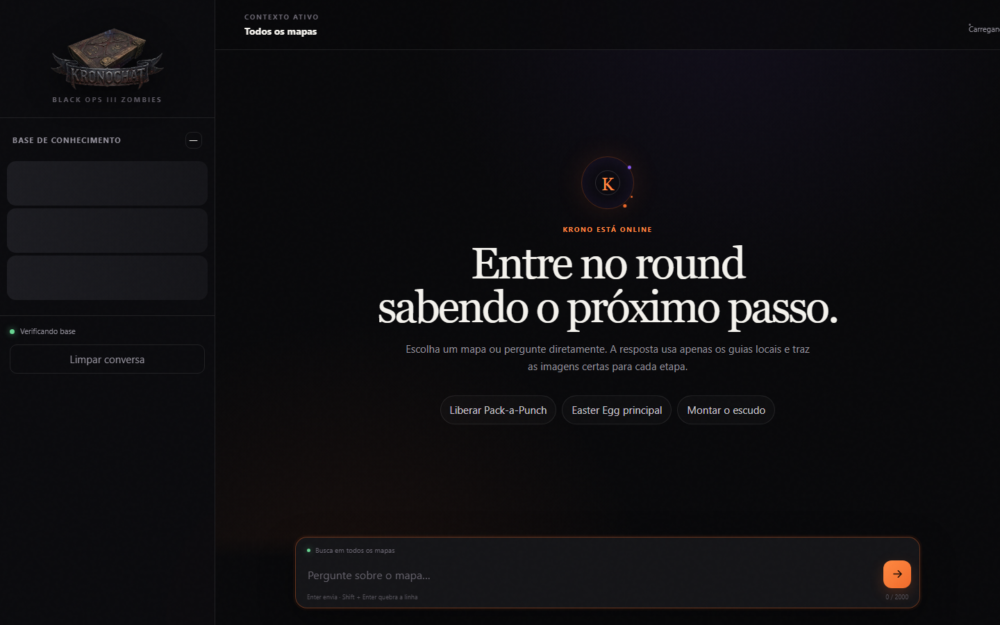
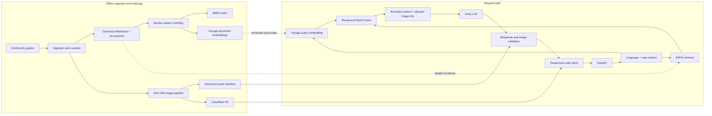
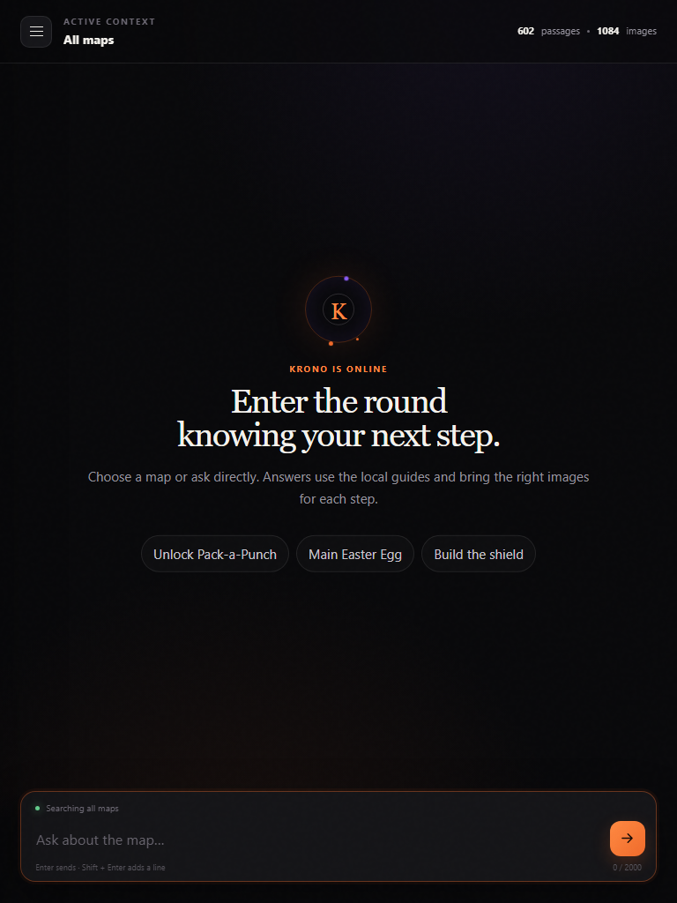

# Kronochat

[](https://github.com/RafaMaluf/zombies-ai/actions/workflows/ci.yml)
[](https://github.com/RafaMaluf/zombies-ai/actions/workflows/ci.yml)
[](https://www.python.org/)
[](LICENSE)

**A retrieval-augmented assistant for Call of Duty: Black Ops III Zombies.**

Kronochat turns a curated, image-linked knowledge base into concise walkthroughs for
Easter eggs, buildables, upgrades and map mechanics. It retrieves the relevant guide
sections, answers in the user's language and returns the screenshots associated with
the exact steps it used.

**[Try the live app](https://zombies.rafaelmaluf.dev/)** ·
**[Health status](https://zombies.rafaelmaluf.dev/health)**



## Why this is not a generic game chatbot

A general-purpose model can recognize terms such as “EE SoE”, but it is unreliable at
long, map-specific sequences and often mixes versions of the game. Kronochat keeps the
model away from retrieval, arithmetic and asset selection decisions it should not make:

- Markdown guides are the canonical source of truth.
- BM25 preserves exact signals such as map names, acronyms and step numbers.
- Voyage embeddings recover paraphrases across Portuguese, English and French.
- Reciprocal Rank Fusion combines both rankings without comparing incompatible scores.
- Only retrieved sections and their registered image IDs enter the prompt.
- The API rejects any image ID the model was not explicitly offered.
- When semantic search is unavailable, a circuit breaker falls back to BM25.

The result is a focused RAG system rather than an LLM wrapped in a chat UI.

## Current scope

| Knowledge base | Count |
| --- | ---: |
| Black Ops III maps | 14 |
| Curated guides | 166 |
| Searchable sections | 602 |
| Registered screenshots | 1,084 |

It covers the six original Black Ops III maps and the eight Zombies Chronicles maps.
The application does not search the web during a conversation.

## Architecture



The vector index is a reproducible artifact, not a second source of truth. At this
scale, a validated local binary index is simpler than operating a vector database.
Its manifest records the model, dimensions, chunk IDs and a content hash, so stale or
incompatible vectors are rejected at startup.

## Retrieval and answer flow

1. The explicit map or active conversation context limits the search space.
2. BM25 and semantic search independently rank guide sections.
3. Reciprocal Rank Fusion merges the rankings and a relative cutoff removes weak hits.
4. Clear single-guide questions stay focused; up to three explicitly requested guides
   can be answered together.
5. The prompt receives only approved text, provenance and candidate image IDs.
6. Groq generates the answer in the active language.
7. The API validates the response and converts image IDs into immutable R2 URLs.

Language starts from `navigator.languages`. Explicit language changes in the user's
message override that preference, while ambiguous canonical terms such as “EE SoE” keep
the current language. Game-specific proper names remain canonical.

## Evaluation

Retrieval is tested without calling an LLM, which makes failures deterministic and
cheap to reproduce.

| Suite | Cases | Languages | Current baseline |
| --- | ---: | --- | ---: |
| Core BO3 maps | 90 | Portuguese, English | 90 / 90 |
| Zombies Chronicles | 49 | Portuguese, English | 49 / 49 |
| Multilingual matrix | 27 | Portuguese, English, French | 27 / 27 |

Each case can assert the inferred map, expected guide at rank one, required guides for
multi-document questions, expected section, image availability and clarification
behavior. CI also enforces at least 90% application-code coverage.

See [the evaluation guide](docs/evaluations.md) for the suite format and hybrid runs.

## Interface

The UI is intentionally map-first: users can pin context, ask across all maps, inspect
the retrieved sources and open step images without leaving the answer. It is also an
installable PWA on supported desktop and mobile browsers. The application shell is
available offline, while retrieval and generated answers still require connectivity.

<p align="center">
  
</p>

## Run locally

### Requirements

- Python 3.10 or newer
- a [Groq API key](https://console.groq.com/keys) for generated answers
- optionally, a Voyage API key for hybrid semantic retrieval

```bash
git clone https://github.com/RafaMaluf/zombies-ai.git
cd zombies-ai
python -m venv .venv
```

Activate the environment and install the development dependencies.

```powershell
# Windows PowerShell
.\.venv\Scripts\Activate.ps1
python -m pip install -r requirements-dev.txt
Copy-Item .env.example .env
```

```bash
# macOS / Linux
source .venv/bin/activate
python -m pip install -r requirements-dev.txt
cp .env.example .env
```

At minimum, set the following value in `.env`:

```dotenv
GROQ_API_KEY=your_key_here
```

To reproduce the production retrieval and image delivery path, also set:

```dotenv
EMBEDDING_PROVIDER=voyage
VOYAGE_API_KEY=your_key_here
VOYAGE_MODEL=voyage-4-large
ASSET_BASE_URL=https://pub-526c370122924a1e842babde6cc44be9.r2.dev
```

The main runtime variables are:

| Variable | Required | Purpose |
| --- | --- | --- |
| `GROQ_API_KEY` | For chat | Server-side key used to generate answers |
| `GROQ_MODEL` | No | Groq model; defaults to `openai/gpt-oss-120b` |
| `EMBEDDING_PROVIDER` | No | Set to `voyage` to enable hybrid retrieval |
| `VOYAGE_API_KEY` | For hybrid search | Embeds each incoming query on the server |
| `VOYAGE_MODEL` | No | Must match the model recorded in the vector manifest |
| `ASSET_BASE_URL` | For remote images | Public object-storage base URL; contains no credential |
| `ALLOWED_ORIGINS` | No | Comma-separated CORS allowlist |

Retrieval limits and migration-only R2 variables are documented in `.env.example`.

Start the server:

```bash
python -m uvicorn app.main:app --reload
```

Open <http://127.0.0.1:8000/app/>. Without Voyage, the application remains available
with BM25-only retrieval. R2 write credentials are required only by the asset migration
tooling and must never be exposed to the browser.

## Docker

After creating `.env`:

```bash
docker compose up --build
```

The application is published at <http://127.0.0.1:8000/app/> and the health endpoint at
<http://127.0.0.1:8000/health>.

## Quality checks

```bash
python -m ruff check app scripts tests
python -m mypy app scripts
python -m pytest --cov=app --cov-report=term-missing --cov-fail-under=90
python -m scripts.validate_kb
python -m scripts.validate_embedding_index
python -m scripts.evaluate_retrieval
python -m scripts.evaluate_retrieval --suite evals/chronicles_queries.json
python -m scripts.evaluate_retrieval --suite evals/multilingual_queries.json
python -m scripts.check_repository_hygiene
```

Mypy checks `app/` and `scripts/` with typed function bodies, explicit optional values,
unreachable-code warnings and redundant/unused suppression warnings. Third-party
packages that do not publish typing metadata are ignored; project code is not.

With Voyage configured, evaluate the hybrid path:

```bash
python -m scripts.evaluate_retrieval --hybrid
python -m scripts.evaluate_retrieval --hybrid --suite evals/multilingual_queries.json
```

With the API running, smoke-test its public surface:

```bash
python -m scripts.smoke_api
python -m scripts.smoke_api --live-chat
```

## Knowledge and asset pipelines

New maps are imported from explicit manifests, normalized into section-based Markdown,
deduplicated and validated before they enter `maps/`:

```bash
python -m scripts.ingest_map ingestion/manifests/nacht_der_untoten.json --dry-run
```

After guide changes, rebuild the semantic index with:

```bash
python -m scripts.build_embedding_index
```

Gameplay images are deliberately absent from Git. A migration script hashes each
source, produces bounded `full.webp` and `thumb.webp` variants, uploads immutable
objects and verifies remote hashes:

```bash
python -m scripts.migrate_images build
python -m scripts.migrate_images upload
python -m scripts.migrate_images verify
```

Read [ingestion](docs/ingestion.md), [knowledge-base](docs/knowledge-base.md) and
[asset-storage](docs/assets.md) documentation before modifying these pipelines.

## Project layout

```text
app/                    FastAPI, retrieval, conversation and model integration
assets/                 Versioned image manifest (no gameplay binaries)
embeddings/             Validated semantic index and manifest
evals/                  Deterministic retrieval suites
frontend/               Responsive dependency-free web client
ingestion/manifests/    Source declarations for imported maps
maps/                   Canonical Markdown guides and provenance
scripts/                Ingestion, indexing, evaluation and migration tools
tests/                  Unit and API integration tests
```

## Deliberate trade-offs and limitations

- The curated base favors reproducibility over open-ended web coverage.
- Answer generation requires Groq; semantic retrieval requires Voyage, but lexical
  retrieval degrades gracefully when Voyage is unavailable.
- Guide quality still depends on source quality and human curation.
- Hard facts such as player-count requirements are partly encoded in prose and should
  continue moving toward structured metadata.
- The service has no user accounts or cross-device conversation persistence.
- Public image URLs can be downloaded by anyone who receives them.
- Call of Duty terminology, screenshots and community guide material are third-party
  content and are not covered by this repository's code license.

## License and third-party material

The original source code in this repository is licensed under the [MIT License](LICENSE).
That license does **not** grant rights to Call of Duty, Black Ops, Zombies, map names,
gameplay screenshots, community guides or any other third-party material.

See [THIRD_PARTY_NOTICES.md](THIRD_PARTY_NOTICES.md) for attribution, provenance and the
scope of the code license. This is a personal, non-commercial fan project and is not
affiliated with or endorsed by Activision or the respective rights holders.
